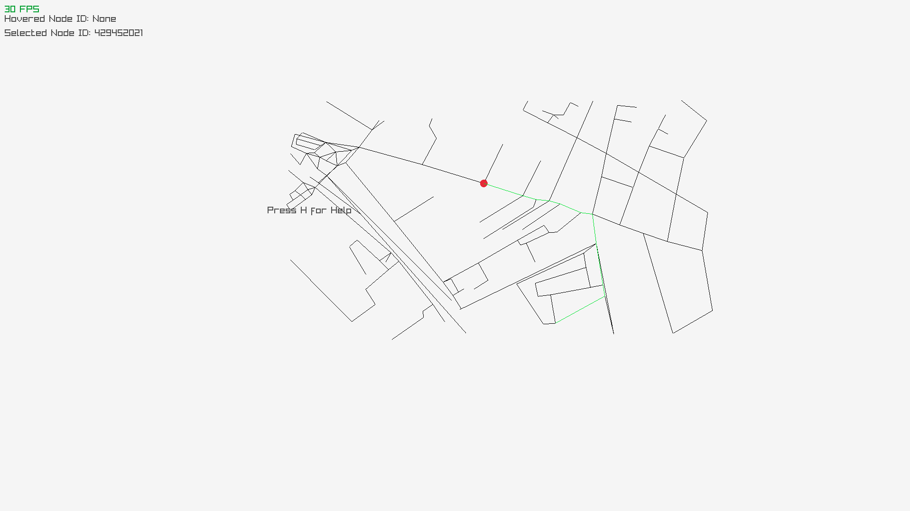

``Exo 1 :``

Commande pour extract :
./osmGraph.exe extract data/test.osm data/test_extract.graph

Commande pour simplify :
./osmGraph.exe simplify data/test_extract.graph

Commande pour visualize :
./osmGraph.exe visualize data/test_extract.graph

``Exo 2 :``

**1.**
Les structures WeightedGraph et PositionedGraph sont définis dans ces deux fichiers (voici les liens de ces fichiers) :

[WeightedGraph](#src/dataStructure/weightedGraph.hpp)

[PositionedGraph](#src/osm/positionedGraph.hpp)

La structure WeightedGraph va permettre de stocker les poids des différents noeuds. Elle possède également les méthodes d'un graphe.
La structure PoisitionedGraph va permettre de stocker la position des différents noeuds (en latitude et longitude). Elle possède également les méthodes d'un graphe.

**2.**
extraction OSM : Ce module va d'abord charger le fichier OSM rentrer en paramètre, puis extraire du fichier les noeuds, poids et limite (latitude et longitude max).
Elle va afficher le nombre de noeuds et de chemins et enfin, va supprimer les rails et bâtiments afin de retourner un graph.

simplification : Ce module va par différentes étapes, simplifier le graphe (voir partie 3 pour les étapes)

visualisation : Ce module tout simplement permettre de visualiser notre carte et d'y incorporer les différentes commandes possibles dans la visualisation.

**3.**
La partie simplification va permettre de simplifier le graphe en gardant dans un premier temps la composante du graphe la plus grande, et supprimer le reste (afin d'avoir un tout connecté),
puis va supprimer les noeuds n'ayant qu'un voisin et une distance dépansant celle rentré en paramètre (de 10), pour ensuite supprimer
les noeuds qui sont au milieu d'une route. Elle va ensuite fusionner les noeuds qui sont trop proches entre eux, refaire le test si des noeux ne sont pas alignés.
Toutes ces étapes vont donc permettre de simplifier le graphe.

``Exo 3.``

Image de la carte : 

